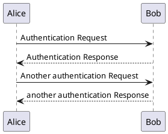

# pandoc-plantuml-filter

Pandoc filter which converts PlantUML code blocks to PlantUML images.

````

````

## Usage

Install it with pip:

```
pip install --force-reinstall git+https://github.com/ursereg/pandoc-plantuml-filter.git
```

And use it like any other pandoc filter:

```
pandoc tests/sample.md -o sample.pdf --filter pandoc-plantuml
```

The PlantUML binary must be in your `$PATH` or can be set with the
`PLANTUML_BIN` environment variable.
