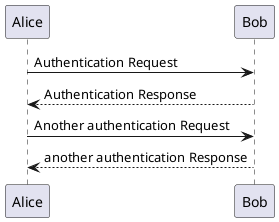

# Some PantUML sample



```{.plantuml caption="Some test diagram"}
@startuml
Alice -> Bob: Authentication Request

alt successful case

	Bob -> Alice: Authentication Accepted
	
else some kind of failure

	Bob -> Alice: Authentication Failure
	group My own label
		Alice -> Log : Log attack start
	    loop 1000 times
	        Alice -> Bob: DNS Attack
	    end
		Alice -> Log : Log attack end
	end
	
else Another type of failure

   Bob -> Alice: Please repeat
   
end
@enduml
```

Nice, huh?
